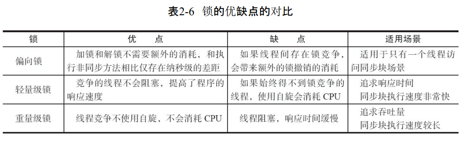

## synchronized

synchronized 实现同步的基础：Java 中的每一个对象都可以作为锁，具体表现为以下三种形式：

- 对于普通同步方法，锁是当前实例对象
- 对于静态同步方法，锁是当前类的 class 对象
- 对于同步代码块，锁是 synchronized 括号里配置的对象

当一个线程试图访问同步代码块时，它首先必须得到锁，退出或抛出异常时必须释放锁

Java SE 1.6 为了减少获得锁和释放锁带来的性能消耗，引入了 "偏向锁" 和 "轻量级锁"，在 Java SE 1.6 中，锁一共有 4 种状态，级别从低到高依次是：无锁状态、偏向锁状态、轻量级锁状态和重量级锁状态，这几个状态会随着竞争情况逐渐升级。锁可以升级但不能降级，意味着偏向锁升级成轻量级锁后不能降级成偏向锁

### 1. Java 对象头

synchronized 用的锁是存在 Java 对象头里的。如果对象是数组类型，则虚拟机用 3 个字宽 ( word ) 存储对象头，如果对象是非数组类型，则用 2 字宽存储对象头。在 32 位虚拟机中，1 字宽即 32 bit

Java 对象头里的 Mark Word 里默认存储对象的 HashCode、分代年龄和锁标志位。32 位 JVM 的 Mark Word 的默认存储结构如表所示：

在运行期间，Mark Word 里存储的数据会随着锁标志位的变化而变化。Mark Word 可能变化为存储以下 4 种数据：

在 64 位虚拟机下，Mark Word 是 64 bit 大小的，其存储结构如表所示：

### 2. 偏向锁

大多数情况下，锁不仅不存在多线程竞争，而且总是由同一线程多次获得，为了让线程获得锁的代价更低而引入了偏向锁。当一个线程访问同步块并获得锁时，会在对象头和栈帧中的锁记录里存储锁偏向的线程 ID，以后该线程在进入和退出同步块时不需要进行 CAS 操作来加锁和解锁，只需简单地测试一下对象头的 Mark Word 里是否存储着指向当前线程的偏向锁。如果测试成功，表示线程已经获得了锁。如果测试失败，则需要再测试一下 Mark Word 中偏向锁的标识是否设置成 1 ( 表示当前是偏向锁 )：如果没有设置，则使用 CAS 竞争锁；如果设置了，则尝试使用 CAS 将对象头的偏向锁指向当前线程

偏向锁使用了一种等到竞争出现才释放锁的机制，所以当其他线程尝试竞争偏向锁时，持有偏向锁的线程才会释放锁。下图中线程 1 演示了偏向锁初始化的流程，线程 2 演示了偏向锁撤销的流程

### 3. 轻量级锁

**轻量级锁加锁**

线程在执行同步块之前，JVM 会先在当前线程的栈帧中创建用于存储锁记录的空间，并将对象头中的 Mark Word 复制到锁记录中，官方称为 Displaced Mark Word. 然后线程尝试使用 CAS 将对象头中的 Mark Word 替换为指向锁记录的指针。如果成功，当前线程获得锁，如果失败，表示其他线程竞争锁，当前线程便尝试使用自旋来获取锁

**轻量级锁解锁**

轻量级锁解锁时，会使用原子的 CAS 操作将 Displaced Mark Word 替换回到对象头，如果成功，则表示没有竞争发生，如果失败，表示当前锁存在竞争，锁就会膨胀成重量级锁

下面是两个线程同时争夺锁，导致锁膨胀的流程图：

#### 4. 锁的优缺点对比

#### 5. 锁的内存语义

锁的释放和获取的内存语义：

- 当线程释放锁时，JMM 会把该线程对应的本地内存中的共享变量刷新到主内存中
- 当线程获取锁时，JMM 会把该线程对应的本地内存置为无效。从而使得被监视器保护的临界区代码必须从主内存中读取共享变量

对比锁释放 - 获取的内存语义与 volatile 写 - 读的内存语义可以看出：

- 锁释放与 volatile 写有相同的内存语义
- 锁获取与 volatile 读有相同的内存语义

锁是 Java 并发编程中最重要的同步机制。锁除了让临界区互斥执行外，还可以让释放锁的线程向获取同一个锁的线程发送消息：

- 线程 A 释放一个锁，实质上是线程 A 向接下来将要获取这个锁的某个线程发出了 ( 线程 A 对共享变量所做修改的 ) 消息
- 线程 B 获取一个锁，实质上是线程 B 接收了之前某个线程发出的 ( 在释放这个锁之前对共享变量所做修改的 ) 消息
- 线程 A 释放锁，随后线程 B 获取这个锁，这个过程实质上是线程 A 通过主内存向线程 B 发送消息

#### 6. 锁内存语义的实现

锁释放 - 获取的内存语义的实现至少有下面两种方式：

- 利用 volatile 变量的写 - 读所具有的内存语义
- 利用 CAS 所附带的 volatile 读和 volatile 写的内存语义

公平锁和非公平锁的内存语义：

- 公平锁和非公平锁释放时，最后都要写一个 volatile 变量
- 公平锁获取时，首先会去读 volatile 变量
- 非公平锁获取时，首先会用 CAS 更新 volatile 变量，这个操作同时具有 volatile 读和 volatile 写的内存语义

#### 7. concurrent 包的实现

由于 Java 的 CAS 同时具有 volatile 读和 volatile 写的内存语义，因此 Java 线程之间的通信现在有了下面 4 种方式：

- A 线程写 volatile 变量，随后 B 线程读这个 volatile 变量
- A 线程写 volatile 变量，随后 B 线程用 CAS 更新这个 volatile 变量
- A 线程用 CAS 更新一个 volatile 变量，随后 B 线程读这个 volatile 变量
- A 线程用 CAS 更新一个 volatile 变量，随后 B 线程用 CAS 更新这个 volatile 变量

如果我们仔细分析 concurrent 包的源代码实现，会发现一个通用化的实现模式：

- 首先，声明共享变量为 volatile
- 然后，使用 CAS 的原子条件更新来实现线程之间的同步
- 同时，配合以 volatile 的读 / 写和 CAS 所具有的 volatile 读和写的内存语义来实现线程之间的通信

AQS，非阻塞数据结构和原子变量类 ( java.util.concurrent.atomic 包中的类 )，这些 concurrent 包中的基础类都是使用这种模式来实现的，而 concurrent 包中的高层类又是依赖于这些基础类来实现的。从整体来看，concurrent 包的实现如下图所示：

